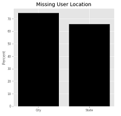
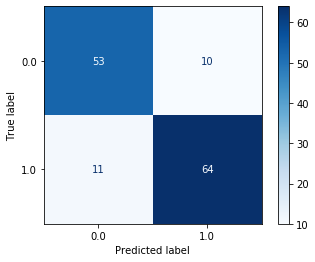
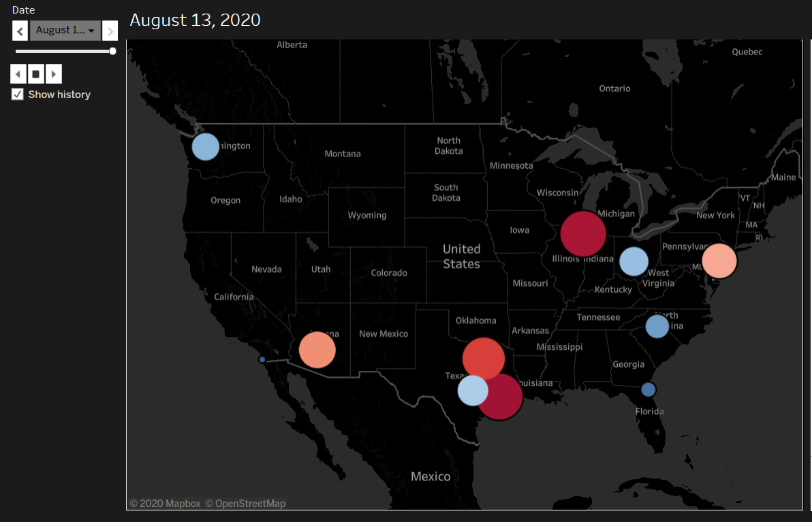

# Mapping Covid-19 using Social Media

**Note:** This is a collaborative project with Jason Lee and Mathew Staples.

- [Problem Statement](#Problem-Statement)
- [Project Summary](#Project-Summary)
- [Project Files](#Project-Files)
- [Data Dictionary](#Data-Dictionary)
- [Data Collection](#Data-Collection)
- [Exploratory Data Analysis (EDA)](#Exploratory-Data-Analysis-(EDA))
- [Data Model](#Data-Models)
- [Tableau Dashboard](#Tableau-Dashboard)
- [Conclusions](#Conclusions)

---

### Problem Statement

In order to protect the privacy of individuals, official information regarding recent confirmed cases of covid-19 are aggregated, stripped of identifying information, and released in large batches. This approach, while necessary, could potentially lose valuable information as well as taking an increased amount of time to release to the public, which can limit its use in allowing those at risk to make informed decisions. In the past decade, social media has become ubiquitous and can potentially be harnessed to gather information to map potential hotspots of corona outbreaks. However, there are many challenges to overcome in order to utilize this new platform for the purposes of improving public health.

---

### Project Summary

We establish here a method to use Twitter in order to track new cases of the corona virus in 15 of the United States' most populated cities. Tweets from users in these cities were gathered and used to train a machine learning model which utilized Natural Language Processing (NLP), which could be used to classify future tweets as relevant or not to our purposes. A simple system was established to gather tweets daily, apply our model, and then map the number of mentioned cases in each city using a Tableau dashboard.

---

### Project Files

The project files are organized as follows:  

**Main Directory/**  
- README.md: Project summary document (this file)
- [presentation.pdf](presentation.pdf): Project presentation slides    
- **code**/
 - [collection.py](collection.py): Python script which scrapes twitter each day and uploads the classified tweets to a SQL server
 - [data_cleaning.ipynb](data_cleaning.ipynb): Notebook code for preprocessing and cleaning tweets for model training and fitting
 - [data_modeling.ipynb](data_modeling.ipynb): Notebook code for training model to predict tweet relevance to new cases of covid-19
 - [BERT_modeling.ipynb](BERT_modeling.ipynb): Notebook code for fine-tuning BERT with tweets to do tweet classification  
 - [p5_functions.py](p5_functions.py): Python script containing project specific functions to reduce excess code in project notebooks and scripts
 - [prediction.py](prediction.py): Python script which contains the modeling function in order to classify tweets as referring to a relevant case of covid-19
 - [scrapy.cfg](scrapy.cfg): Config file for the TweetScraper module
 - [train_collection.ipynb](train_collection.ipynb): Notebook containing code used to gather the initial training data as well as exploratory data analysis (EDA)
 - **pickle**/
   - [feature.pkl](feature.pkl): Pickle file for creating additional data features for modeling
   - [model.pkl](model.pkl): Pickle file for tweet prediction model
   - [vectorizer.pkl](vectorizer.pkl): Pickle file for word vectorizing tweets for NLP
 - **TweetScraper**/
   - All files in this directory are for the TweetScraper spider used to gather tweets. All credit for this module goes to the original creator, github repo [here](https://github.com/jonbakerfish/TweetScraper)
- **data**/
 - [redacted_training.csv](redacted_training.csv): CSV containing the tweets used to train the NLP model used for classifying tweets
 - [user_loc.csv](user_loc.csv): CSV containing the geolocation data for the tweets in the training data. Empty values indicate that no location was provided by the original user
- **images**/
 - Directory containing image files for figures and charts

---

### Data Dictionary

After processing, all tweets are entered into a SQL database table with the following structure

|Feature|Type|Description|
|---|---|---|
Tweet|str|The text of the tweet, with names removed for privacy
City|str|City the tweet originated from
State|str|Two letter code for the US state the tweet originated from
Date|str|Date that the tweet was posted
Label|int|Class of the tweet: (1) for tweets describing local, recent positives, (0) otherwise

---

### Data Collection

When determining which platforms to utilize in order to track cases of the corona virus, there were several factors to consider. Popularity is a large factor, since having a greater number of users would generate a correspondingly larger amount of data. Furthermore, it should be a platform where user location could be determined, while also providing an avenue for individuals to discuss new cases (eliminating apps such as Instagram, which is largely visual). From this, the two potential candidates were Twitter and Facebook. However, while Facebook would be a valuable source of information, the website is very restrictive when it comes to webscraping. Thus, we opted to solely use Twitter, due to their more amenable stance toward scraping.

However, due to the limitations of Twitter's official API, we elected to use a third-party scraper in order to gather our tweet data. To this end, we utilized TweetScraper, for which all credit goes to the original creator (github repo [here](https://github.com/jonbakerfish/TweetScraper)). This module was largely unmodified for our implementation beyond minor tweaks to various settings to fit our needs.

Using TweetScraper, we searched for tweets containing the phrase "tested positive" as we are interested in information about new cases, rather than general discussion about the virus itself. This query was used to gather approximately 4,500 tweets from the month of March to serve as a data set in order to train the machine learning model. These tweets were manually assigned a label of 1 or 0 depending on their relevance to our problem statement.

The data collection script has been uploaded to a virtual machine where it is scheduled to run once a day, process the data, and then upload the information to a SQL database for storage.

---

### Exploratory Data Analysis (EDA)

From the initial date scrape, it became clear that there would be challenges when using a platform such as Twitter in order to perform data analysis and model prediction. Our two main concerns are user location and mention of a positive case of covid-19. However, most users do not include their location, which is optional, in their profiles. In our training data, more than 60% of users do not include their city and state information, which precludes using those tweets for geolocation purposes (Fig. 1).

**Figure 1**. User location data rate

In addition, after manual classification of the tweets, we found that a vast majority of tweets containing the phrase "tested positive" were not referencing a local case. Most tweets containing the phrase were discussing news stories, politics, celebrity diagnoses, or even memes, which were not relevant for our purpose. Of the nearly 4,500 tweets in the data set, only about 5% of the tweets were classified as positives for our model. This class imbalance had to be accounted for when creating our model, and is explained in further detail in that section.

To address the location issue, we utilized the "near:" parameter in twitter searches. Rather than try to evaluate every tweet, we instead focused on mapping positive mentions in some of the most populous cities in the nation, which are often where diseases spread the most, in any case. The list of cities we focused on is:

| | |
|---|---|
New York City, NY|Seattle, WA
San Francisco, CA|Los Angeles, CA
Chicago, IL|Houston, TX
Phoenix, AZ|Philadelphia, PA
San Antonio, TX|San Diego, CA
Dallas, TX|San Jose, CA
Austin, TX|Jacksonville, FL
Fort Worth, TX|Columbus, OH
Charlotte, NC

---

### Data Model

The training data used is imbalanced, where 94% is classified as negative and 6% positive. To mitigate the issue, an upsampling of the positive class and downsampling of the negative class was performed. The final training dataset is composed of 550 data, where 300 are classified as positive, and 250 are negative, establishing a baseline score of 54%.  Using Logistic Regression, token words with an absolute value of coefficient greater than 0.05 are selected as features.

When choosing models, a significant consideration is our overall objective. Since our goal is to establish a model that can accurately classify tweets as a positive or negative class, Gradient Boosting and Random Forest Classifiers are chosen due to their nature of giving high accuracy scores. However, they tend to overfit quickly. Therefore Logistic Regression and Multinomial Naive Bayes are also selected since they are simpler models and are easier to regularize. To further maximize the accuracy, specificity, and sensitivity scores, a Voting Classifier was established using the top three models with the highest testing metric score.

The final selected model is the Voting Classifier with an 85% training accuracy, 84% testing accuracy, 84% specificity, and 85% sensitivity scores.

**Figure 2**. Model Confusion Matrix

---

### Tableau Dashboard

Our dashboard is hosted on Tableau Public [here](https://public.tableau.com/views/COVID-19Hotspots_15973852974230/COVID-19Hotspots?:language=en&:display_count=y&:origin=viz_share_link).

In order to make the dashboard publicly available with a live connection to the data, the MS SQL Server is connected to Google Sheets via the Castodia Database Connector add-on and refreshes daily after the SQL server is updated. The Tableau workbook is connected to this Google Sheet and requests the updated data daily.

**Figure 3**. Covid-19 Tweets Heat Map (from dashboard)

The main visual is an animated heat map of the running total of positive class tweets in each city. "Cases Per Day" graphs the number of positive tweets per day along with the cumulative sum up until a given date. "One Day Difference in Cases Reported" graphs the day-to-day change in number of positive tweets. "Totals by City" shows the to-date sum of positive tweets by city. Selecting a city on the map or "Totals by City" graph filters the "Cases Per Day" and "One Day Difference in Cases Reported" graphs to only show data for that city. The default for these is to show U.S. level data.

---

### Conclusions

In summary, we have created an application which is capable of tracking new cases of covid-19 in major cities across the United States, with a delay of no more than 24 hours. By harnessing social media, we are able to provide near real-time information that is publicly accessible through our dashboard, while still protecting privacy and anonymity. Given more time and resources, it would be possible to expand our work in several ways. Exploring other social media platforms would not only increase the amount of information gathered, but would sample from a potentially different population than what we could originally reach. Using more sophisticated NLP analysis methods could also potentially allow us to determine user location even if not provided, such as by analyzing a user's past tweets to determine place of residence. It could also be used to further pinpoint cases beyond city (many tweets referenced local businesses or buildings, which may be possible to parse out). Furthermore, the system is easily adaptable to gather other geographic information, as the only thing that would be necessary to change would be the Twitter search terms in order to gather data pertaining to other subjects. We have provided here a solid foundation for implementing social media as a tool for generating geographic information and analysis.
